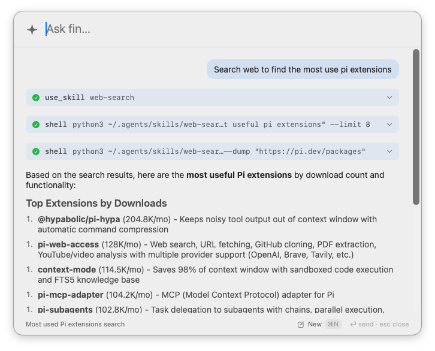

# beacon

A Spotlight-style macOS popup for the [`fin`](https://github.com/meain/fin) CLI agent:
open it, ask a question, watch a syntax-highlighted markdown answer stream in, approve
tool calls inline, and continue the conversation.



New here? See [GETTING_STARTED.md](GETTING_STARTED.md).

## How it works

`fin` exposes a machine-readable frontend via `fin -ui json` (added in the fin repo):
it emits newline-delimited JSON events on stdout and reads tool-approval decisions from
stdin. `beacon` spawns that process, decodes the event stream, and renders it.

```
beacon  ──spawn──▶  fin -ui json "<prompt>"
   ▲                        │ stdout (JSONL events)
   │  approvals (stdin)     ▼
   └────────────────  {"t":"text"|"tool_start"|"tool_done"|"approval"|...}
```

Event stream (one JSON object per line):

| type | meaning |
|------|---------|
| `text` | streamed assistant markdown delta |
| `end` | end of a text block |
| `tool_start` / `tool_output` / `tool_done` | tool lifecycle |
| `approval` | tool needs approval → reply `{"approve":true|false}` on stdin |
| `session` / `info` / `retry` / `error` | status |

`beacon` also synthesises a `stderr` event from the process's stderr so provider/retry
errors surface in the transcript. Previous chats are read straight from fin's session
JSONL files (`~/.local/share/fin/sessions`) — no extra fin process.

## Build & run

```bash
make run       # dev: build and open the popup
make app       # release: produces beacon.app
make install   # copy beacon.app into /Applications
make link      # symlink beacon.app into /Applications (tracks this build)
make fin       # install the patched fin CLI from ../fin
make help      # list all targets
```

Requires the patched `fin` on your `PATH` (`go install .` in the fin repo). beacon
resolves `fin` via a login shell, falling back to `~/.local/share/go/bin/fin` etc.
